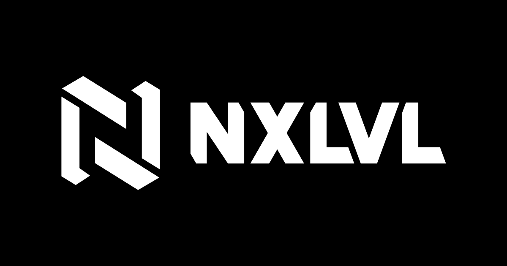

  

# NXLVL brand assets

The logo, wordmark and icon set for **NXLVL**, an esports tournament platform.
Everything here is drawn from one geometry module, so the SVGs, the 61 PNGs and
every number in [BRAND-GUIDELINES.md](BRAND-GUIDELINES.md) are guaranteed to agree with each other.

> **Using the NXLVL name or logo?** Read [what you may and may not do](#permissions)
> before you ship. Short version: press, community content and "works with NXLVL"
> integrations are fine as-is; altering the mark or implying we endorse you is not.

## Download

**[⬇ Download the whole kit (nxlvl-brand-kit.zip, 2.0 MB)](nxlvl-brand-kit.zip?raw=1)**

Or take single files straight from [`svg/`](svg) and [`png/`](png). Every variant is
laid out on one sheet in **[png/contact-sheet.png](png/contact-sheet.png)** if you would rather look first.

## Which file do I want?

Start here; the rest of the table is detail.

| If you are… | Use |
| --- | --- |
| Putting the logo on a dark background | [`svg/nxlvl-lockup-white.svg`](svg/nxlvl-lockup-white.svg) |
| Putting the logo on a light background | [`svg/nxlvl-lockup-black.svg`](svg/nxlvl-lockup-black.svg) |
| Filling a square or portrait space | `svg/nxlvl-stacked-*.svg` |
| Making an avatar, favicon or app icon | `svg/nxlvl-mark-*.svg`, or a ready-made size from [`png/icon/`](png/icon) |
| Already showing the mark nearby | `svg/nxlvl-wordmark-*.svg` |
| Somewhere PNG is the only option | [`png/2x/`](png/2x) for print and retina, [`png/1x/`](png/1x) for screen |

**Prefer the SVGs.** They are flat polygons — no fonts, no strokes, no filters —
so they scale to any size, print correctly, and stay a few kilobytes.

### The four artworks

| | Proportions | For |
| --- | --- | --- |
| **Lockup** | 2360 × 700  ·  3.37 : 1 | The primary logo. Use this unless something stops you. |
| **Stacked** | 1568 × 1263  ·  1.24 : 1 | Square and portrait spaces the lockup would shrink into. |
| **Wordmark** | 1568 × 375  ·  4.18 : 1 | Where the mark already appears nearby. |
| **Mark** | 1000 × 1000  ·  1.00 : 1 | Avatars, favicons, app icons. Never as a substitute for the name on first use. |

Rounded for reading; the artwork itself is not. Exact coordinates are in
[BRAND-GUIDELINES.md](BRAND-GUIDELINES.md#the-module).

### The four PNG treatments

| Suffix | Ink | Background | Padding |
| --- | --- | --- | --- |
| `-black` | black | transparent | none — tight to the ink |
| `-white` | white | transparent | none — tight to the ink |
| `-on-black` | white | black | clear space already applied |
| `-on-white` | black | white | clear space already applied |

The transparent pair is for compositing onto your own background — you apply the
clear space. The grounded pair already carries it, because there the file *is*
the layout.

## The three rules

1. **Leave it room.** 375 units of clear space on every side — one cap
   height. See [Clear space](BRAND-GUIDELINES.md#clear-space).
2. **Do not redraw it.** No recolouring, stretching, rotating, outlining, shadows
   or effects. Two inks, black and white, and nothing else.
3. **Do not make it tiny.** 120 px wide for the lockup, 16 px for the mark.

[BRAND-GUIDELINES.md](BRAND-GUIDELINES.md) has the full set, including what the
geometry is doing and why the two L's are not the same shape.

## Permissions

These assets are **not** open source — a logo is a trademark, not code. They are
[© NXLVL, all rights reserved](LICENSE). That said, the whole point of publishing
them is that you can use them, so:

**You may, without asking:**

- Use the logo in **press, articles and reviews** about NXLVL.
- Make **community content** — guides, videos, streams, server art — that is
  clearly about NXLVL rather than pretending to be NXLVL.
- Show the logo to say your product **works with, integrates with, or is built on**
  NXLVL, at a size no larger than your own logo.

**You may not, without written permission:**

- Suggest NXLVL **endorses, sponsors or is affiliated with** you when it does not.
- **Alter the artwork** — recolour, distort, rotate, add effects, or take the mark
  apart and reuse a piece of it.
- Use it in your own **product name, logo, domain or app icon**.
- Put it on **merchandise** for sale.

Not sure whether what you are planning is fine? Ask first — open an issue.

## Updating these files

Nothing here is edited by hand. The artwork is generated from a single geometry
module in the NXLVL application repo and published with one command, so this repo
is a build output. File an issue rather than a pull request against the artwork —
a fix has to go into the module or it will be overwritten on the next publish.
